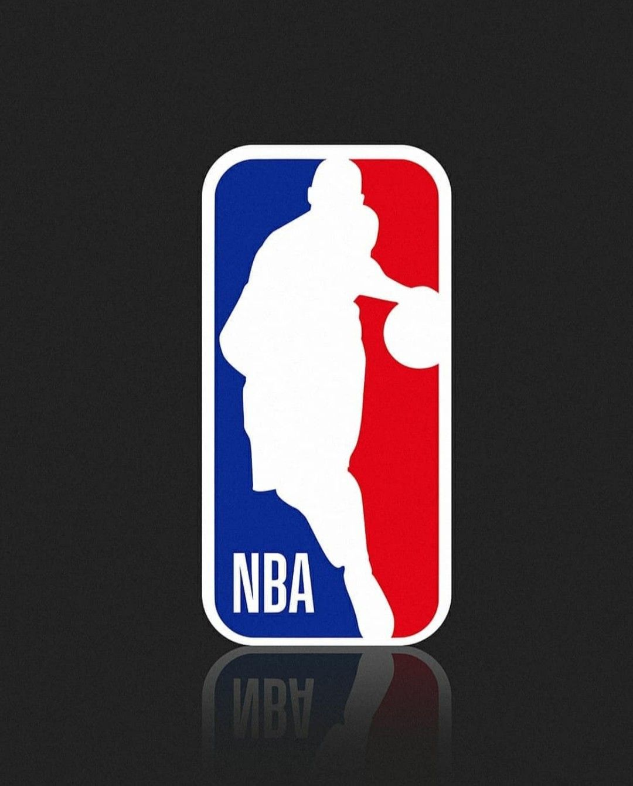

# NBA Analysis

**Team Members:Ananya Mishra, Matthew Cagle, Tara Manhas and Roberto Infante**

## Overview
Our final project is based on NBA games, mainly focused on every game played between the time period 2014-2018.
Through the data extraction in this project, a lot of statistics will reveal important aspects of the game play of individual teams. The main questions that will be answered through our project are:
-Which teams play the best defensively and offensively, season wise?
-What are the overall statistics for each team from season to season?

This is being done by a way of assigning a certain amount of points to each team dependent on the amount of team goals, 3 pointer shots, Free throws, Off Rebounds, Assists, Turnovers, and total number of fouls. This further helps in deciding which team has played the best offensively and defensively over the season in the span on 2014-2018.

## Target Audience

We don't have a specific target audience, however, it is most likely that NBA Fans would like to access this type of data to learn more about the history _(2014-2018)_ of NBA, and get an analysis of their desired team.

## Side Panel & Main Panel

Our side panel consists of a check-box widget which allows you to get data by **teams** and also allows you to compare performances of the selected teams. This data is then displayed through a _scatter plot_ in the main panel.

## Tabs

There are 5 Tabs in our shiny app. The first being the  Introduction, followed by a tab that represents all of the defensive gameplay statistics for all teams, displayed through plots, and then a tab that represents offensive gameplay statistics, again displayed through a scatter plot. And then, we have a tab called best/worst team, which summarizes all our data, and informs the user of which team played best offensively and defensively in each season over the years 2014-2018. Finally, we have a tab that contains a table with the original data that our analysis has been extracted from. This is made available for the user to see all kinds of data for each and every team, organized by dates, enabling them to see overall statistics of all the teams.

## Shiny App Link

[Link to Shiny App](https://amishra9.shinyapps.io/NBA-Analysis/)
